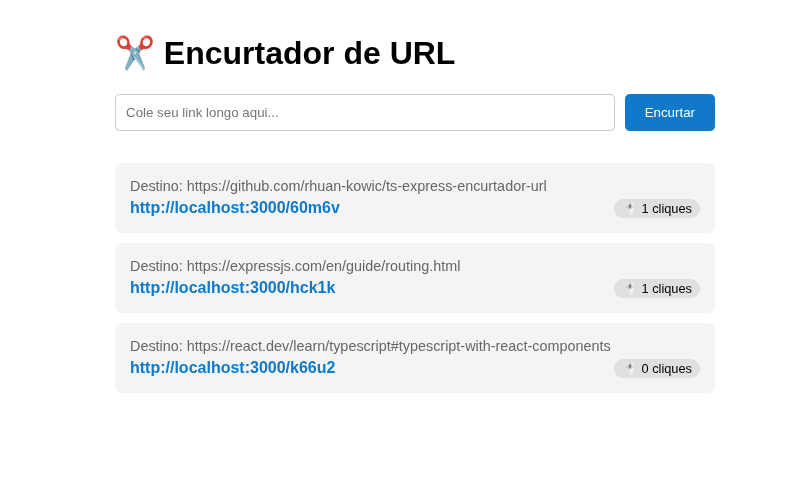

# 🎨 TS React Encurtador Web

> Interface moderna e responsiva para o sistema de Encurtamento de URLs, desenvolvida com React, TypeScript e Vite.


## 💻 Sobre o Projeto

Este projeto é o Front-end da aplicação **Encurtador de URL**. Ele consome a API REST desenvolvida em Node.js para permitir que usuários criem links curtos e acompanhem as estatísticas de cliques em tempo real.

O foco do desenvolvimento foi a componentização, tipagem estática e a integração com a API via Fetch API.



### ✨ Funcionalidades

- [x] **Encurtar Link:** Formulário para envio de novas URLs.
- [x] **Listagem em Tempo Real:** Exibe os links criados e a contagem de cliques.
- [x] **Feedback Visual:** Indicadores de carregamento (`loading`) durante as requisições.
- [x] **Integração:** Conexão completa com o Backend rodando localmente.

---

## 🛠️ Tecnologias Utilizadas

- **Core:** React (Hooks: `useState`, `useEffect`)
- **Linguagem:** TypeScript
- **Build Tool:** Vite
- **Comunicação:** Fetch API (com services isolados)
- **Estilização:** CSS-in-JS (Inline Styles para simplicidade)

---

## 📂 Estrutura do Projeto

O projeto segue uma arquitetura limpa e modular:

```text
src/
├── components/   # Componentes visuais isolados
│   ├── LinkForm.tsx   # Formulário de input
│   └── LinkItem.tsx   # Card de exibição do link
├── services/     # Camada de comunicação com a API
│   └── api.ts         # Métodos GET e POST centralizados
├── types/        # Interfaces TypeScript compartilhadas
│   └── Link.ts        # Contrato de dados (Model)
└── App.tsx       # Componente principal (Gerenciamento de Estado)
```

## 🚀 Como Rodar o Projeto

**Pré-requisitos**

1. Ter o Node.js instalado.
2. IMPORTANTE: O Backend deve estar rodando na porta 3000.

**Passo a Passo**

```bash
# 1. Clone o repositório (se ainda não baixou)
$ git clone [https://github.com/rhuan-kowic/ts-react-encurtador-web.git](https://github.com/rhuan-kowic/ts-react-encurtador-web.git)

# 2. Acesse a pasta do projeto
$ cd ts-react-encurtador-web

# 3. Instale as dependências
$ npm install

# 4. Inicie o servidor de desenvolvimento
$ npm run dev
```

O projeto abrirá automaticamente no seu navegador (geralmente em http://localhost:5173).

## 🔗 Integração com o Backend

Repositório da API: https://github.com/rhuan-kowic/ts-express-encurtador-url
Este frontend espera que a API esteja rodando em http://localhost:3000. As rotas consumidas são:

- GET /links: Para listar todos os encurtamentos.
- POST /encurtar: Para criar novos registros.

**Nota:** Certifique-se de que o CORS está habilitado no seu servidor Node.js.
